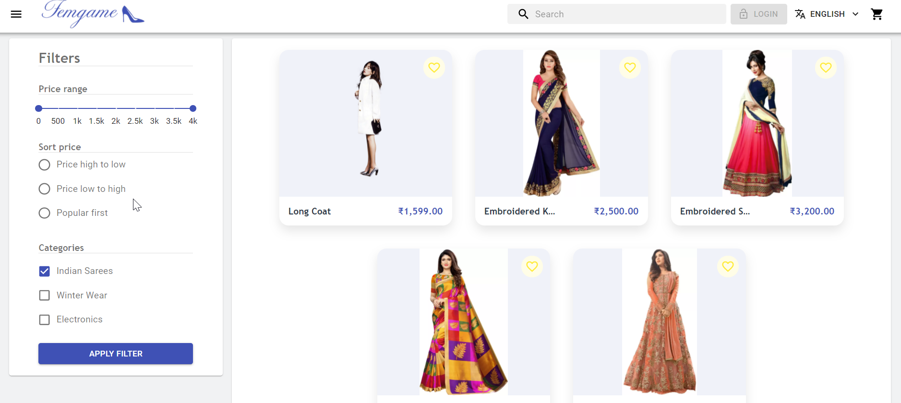
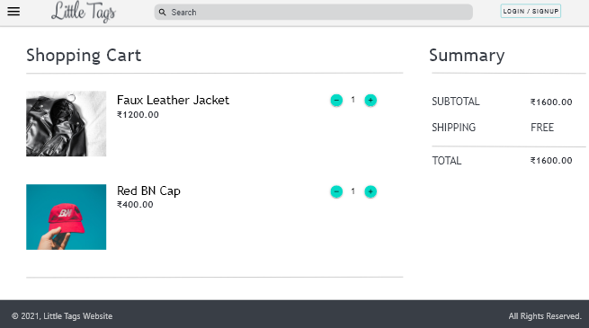
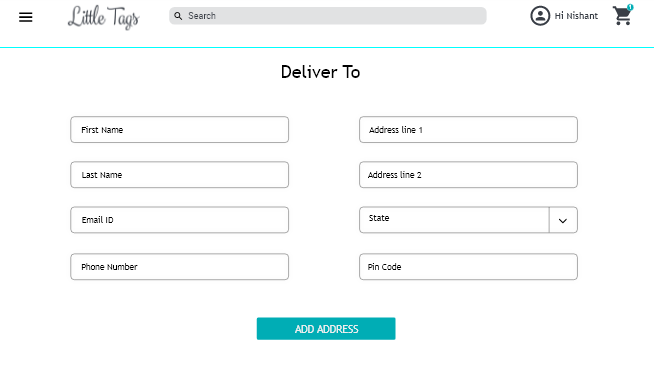
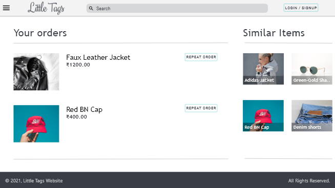
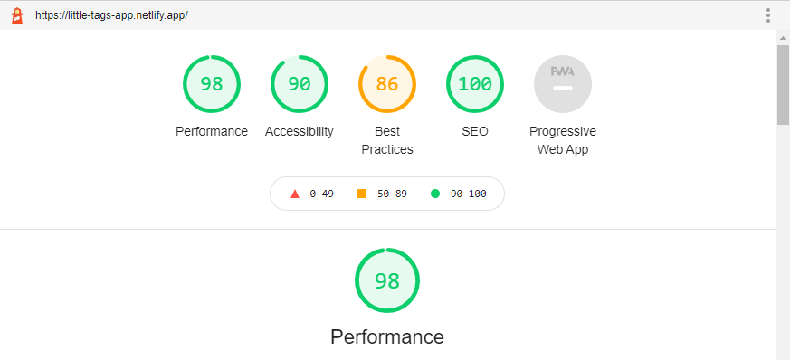

# Project

- [FrontEnd](https://github.com/Piyush-Ranjan-Mishra/femgame-fe.git)

- [BackEnd](https://github.com/Piyush-Ranjan-Mishra/femgame-be.git)


- [About](#Femgame)
- [Screenshots](#Screenshots)
- [Prerequisites](#prerequisites)
- [Getting Started](#getting-started)
- [Running tests](#running-tests)
- [Code Style](#code-style)
- [Adding custom Icons](#adding-custom-icons)
- [Misc](#misc)

# Prerequisites

- [node](https://nodejs.org/en/download/)
- [yarn](https://yarnpkg.com/en/docs/install) package manager (instead of npm)
- [material-ui](https://material-ui.com/getting-started/installation/)
- [VSCode](https://code.visualstudio.com/download) editor for good typescript intellisense
  - [Prettier](https://marketplace.visualstudio.com/items?itemName=esbenp.prettier-vscode) extension for consistent code formatting
  - [tslint](https://marketplace.visualstudio.com/items?itemName=eg2.tslint) extension for consistent code style
  - [styled-components](https://marketplace.visualstudio.com/items?itemName=jpoissonnier.vscode-styled-components) extension for [styled-components](https://www.styled-components.com/) intellisense

# Getting started

With all the prereqs installed:

1.  clone this repo,
2.  `cd` into it and run `yarn install`. This will install all the node dependencies we need for development.
3.  Update .env file if necessary `cp .env.example .env`
4.  Run `yarn start` to start the react dev server in specified environment.
5.  Open <http://localhost:3000> on your browser

# Screenshots

|                                    |                                        |
| :--------------------------------: | :------------------------------------: |
|          |    |
|  |           |
|          |          |
|        |  |


# Performance

1. Pre-rendered static website(SSR)
2. CSS from scratch to for lower bandwidth no bootstrap or material-ui
3. Implemented lazy loading and skeleton ui
4. Used webp image for faster rendering
5. Used different image sizes for mobile to reduce bandwidth charge for users
|        |  |

# Femgame

[Femgame](https://keen-hamilton-203206.netlify.app/) is ecommerce website built in React.
eature list are as follow:

1.  User Login
2.  Product Search Feature
3.  Category page Product with extended filtering by brand, pricing etc
4.  Single Product page with the price, description, rating, images, quantity, add to cart, add to wishlist etc
5.  Wishlist
6.  Checkout (Product review, Address, Payments)
7.  Past Orders
8.  Routes changing upon going to different screens
9.  Mobile responsive
10. Internationalization and localization

# Running tests

## Unit Tests

- run `yarn unit-test` to run the unit tests

## Cypress Tests

# Code style

We have come up with some rules to keep code consistent accross the application. These rules are enforced by [`TSLint`](https://palantir.github.io/tslint/) where possible, but if you are unsure please refer to the evolving list below:

1.  We decided to go with functional approach (i.e. exporting functions) unless it is really beneficial to use classes
2.  We also decided to enforce `async/await` instead of `Promises`
3.  The file structure should also be pretty strict and enforced (i.e. not putting almost anything to the `root` folder)
4.  It's better to use template strings instead of concatenation
5.  We are enforcing imports instead of requires
6.  No JS files should be pushed unless there is a specific reason JS is being used (i.e. test files are currently JS)
7.  We have decided to use `console.info` for logging useful runtime information. Using `console.log` is preferred for some debugging cases and will produce a `TSLint` warning reminding you to clean up your old debugging logs
8.  When writing helper functions with more than two params, especially optional params, consider having one `config` param which is an object that is destructured instead. This will prevent cases where we call a function with `undefined` params:

    ```
    helper(undefined, undefined, paramWeWantToPass)
    ```

    and make code more readable

    ```
     helper({ param: paramWeWantToPass })
    ```

    When you encounter a function with a too many params in the codebase, refactor it to the preferred pattern in your PR.

## Application structure

(Many of these rules have been liberally repurposed [from here](https://angular.io/guide/styleguide#file-structure-conventions))

## Single responsibility

Apply the
<a href="https://wikipedia.org/wiki/Single_responsibility_principle"><i>single responsibility principle</i> (SRP)</a>
to all components, functions, and other symbols.
'Gather together those things that change for the same reason, and separate those things that change for different reasons.'
This helps make the app cleaner, easier to read and maintain, and more testable.

### Rule of One

**Do** define one thing, such as a service or component, per file.

**Consider** limiting files to 400 lines of code.

**Why?** One component per file makes it far easier to read, maintain, and avoid
collisions with teams in source control.

**Why?** One component per file avoids hidden bugs that often arise when combining components in a file where they may share variables, create unwanted closures, or unwanted coupling with dependencies.

The key is to make the code more reusable, easier to read, and less mistake prone.

As the app grows, this rule becomes even more important.

### Small functions

**Do** define small functions

**Consider** limiting to no more than 75 lines.

**Why?** Small functions are easier to test, especially when they do one thing and serve one purpose.

**Why?** Small functions promote reuse.

**Why?** Small functions are easier to read.

**Why?** Small functions are easier to maintain.

**Why?** Small functions help avoid hidden bugs that come with large functions that share variables with external scope, create unwanted closures, or unwanted coupling with dependencies.

### _LIFT_

**Do** structure the app such that you can **L**ocate code quickly,
**I**dentify the code at a glance,
keep the **F**lattest structure you can, and
**T**ry to be DRY.

**Do** define the structure to follow these four basic guidelines, listed in order of importance.

**Why?** LIFT provides a consistent structure that scales well, is modular, and makes it easier to increase developer efficiency by finding code quickly.
To confirm your intuition about a particular structure, ask:
_can I quickly open and start work in all of the related files for this feature_?

### Locate

**Do** make locating code intuitive, simple, and fast.

**Why?** To work efficiently you must be able to find files quickly,
especially when you do not know (or do not remember) the file _names_.
Keeping related files near each other in an intuitive location saves time.
A descriptive folder structure makes a world of difference to you and the people who come after you.

### Identify

**Do** name the file such that you instantly know what it contains and represents.

**Do** be descriptive with file names and keep the contents of the file to exactly one component.

**Avoid** files with multiple components, multiple services, or a mixture.

**Why?** Spend less time hunting and pecking for code, and become more efficient.
Longer file names are far better than _short-but-obscure_ abbreviated names.

It may be advantageous to deviate from the _one-thing-per-file_ rule when
you have a set of small, closely-related features that are better discovered and understood
in a single file than as multiple files. Be wary of this loophole.

### Flat

**Do** keep a flat folder structure as long as possible.

**Consider** creating sub-folders when a folder reaches seven or more files.

**Why?** No one wants to search for a file through seven levels of folders.
A flat structure is easy to scan.

On the other hand,
<a href="https://en.wikipedia.org/wiki/The_Magical_Number_Seven,_Plus_or_Minus_Two">psychologists believe</a>
that humans start to struggle when the number of adjacent interesting things exceeds nine.
So when a folder has ten or more files, it may be time to create subfolders.

Base your decision on your comfort level.
Use a flatter structure until there is an obvious value to creating a new folder.

### _T-DRY_ (Try to be _DRY_)

**Do** be DRY (Don't Repeat Yourself).

**Avoid** being so DRY that you sacrifice readability.

**Why?** Being DRY is important, but not crucial if it sacrifices the other elements of LIFT.
That's why it's called _T-DRY_.
But if something is not obvious or departs from a convention, then spell it out.

### _Folders-by-feature_ structure

**Do** create folders named for the feature area they represent. Treat these folders as separate modules, and think about what is exposed from them

**Why?** A developer can locate the code and identify what each file represents
at a glance. The structure is as flat as it can be and there are no repetitive or redundant names.

**Why?** The LIFT guidelines are all covered.

**Why?** Helps reduce the app from becoming cluttered through organizing the
content and keeping them aligned with the LIFT guidelines.

**Why?** When there are a lot of files, for example 10+,
locating them is easier with a consistent folder structure
and more difficult in a flat structure.

**Do** think about what's exported from each feature area. This is the api to that module.

**Do** keep files that work on the same feature / part of the domain, located closely together.
